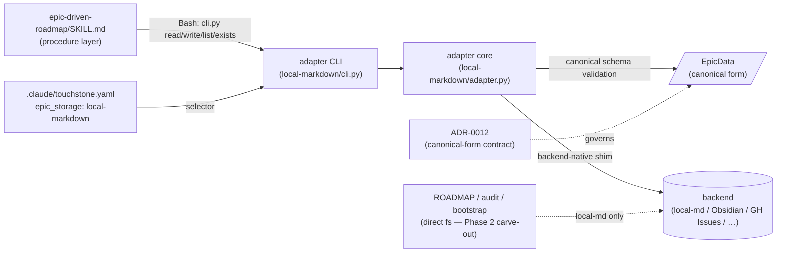

# Storage adapter interface — Design Spec

**Date:** 2026-05-29
**Status:** Accepted (human-accepted 2026-05-30; cleared `/touchstone:design-review` blocking gate after pass-2 fix — pass-1 4H/6M/2L resolved, pass-2 1H/3M/2L resolved; see `.touchstone/reviews/2026-05-30-storage-adapter-interface-design-gate{,-pass2}/review.md`)

## Foundation

- **Intention (why):** `epic-driven-roadmap` mixes workflow logic with local-markdown IO assumptions — file paths, table layouts, frontmatter keys all live inside SKILL.md prose. Two pains follow: (a) adopters wanting GitHub Issues, Obsidian MCP, or Linear cannot adopt the workflow without forking the skill; (b) a future backend that silently drops a field (e.g. `landed`) would mis-judge the Stage 7 ship gate — a silent false-green at the storage boundary, the exact failure the honesty spine forbids.
- **Aim:** the **epic-index access path** of `epic-driven-roadmap` is split into a procedure layer (SKILL.md prose, workflow logic only) and a storage adapter layer (deterministic script implementing the canonical contract from ADR-0012). The local-markdown adapter is implemented as the reference; it round-trips every existing epic in `.touchstone/epics/` losslessly on canonical fields, and throws loud on schema mismatch, sidecar drop, or canonical-serialisation loss. ROADMAP-membership and doc-graph audit operations are explicitly carved out of this phase (see Scope).
- **Out of scope:**
  - Obsidian MCP / GitHub Issues / Linear adapters — follow-up epics
  - ROADMAP.md mutation and the audit doc-graph scan — not routed through the adapter in Phase 2 (see Scope carve-out below); Phase 3+ revisits if needed
  - Phase 5 L1/L2 spec-contract surface — separate phase of this epic
  - Phases 3-4 of this epic (atomic-skill decoupling, portability fix-ups)
  - Canonical schema-version migration tooling — first version, nothing to migrate from yet (Open Question)
  - Multi-agent concurrency / lost-update prevention — single-agent assumption (see Invariants); future-epic concern

## Source-level Deposit

- **Lever this spec advances:** `none` — touchstone has no formal lever menu defined yet (per the `portability-and-storage-adapters` epic, this is treat-the-plugin-as-a-product work that establishes the patterns future levers will reuse). The deposit this spec makes is the storage adapter interface as a **checkable code-level contract** (canonical schema + adapter CLI) rather than implicit prose in SKILL.md — the source encoding directly replaces a class of bridge-doc explanation.
- **Bridge docs this spec creates (if any):** this spec itself; `kill-on: portability-and-storage-adapters`. `skills/epic-driven-roadmap/adapters/interface.md` (the human-readable contract) also created; same `kill-on`. ADR-0012 (canonical-form contract, already shipped) is the durable decision bridge.
- **Bridge docs this spec will retire on landing:** sections of `epic-driven-roadmap/SKILL.md` and `references/close-and-stage7.md` that currently explain frontmatter keys / table layout / index.md structure — those become unnecessary once procedure prose calls the adapter CLI.
- **Three-principle audit:**
  - **P1 (non-duplication):** this spec carries the procedure↔adapter boundary contract, which source does not yet encode. Source paths checked: `skills/epic-driven-roadmap/SKILL.md`, `skills/epic-driven-roadmap/references/close-and-stage7.md`, `skills/epic-driven-roadmap/templates/epic-index.md`. None contains the adapter interface today.
  - **P2 (falsifiable):** AC-3 + AC-3b (golden source fixtures) deterministically probe the parse and round-trip; AC-1 grep probe falsifies procedure-prose purity.
  - **P3 (no single host):** the contract spans SKILL.md prose, the adapter script, every epic file on disk, and the config selector. No single symbol or file body hosts it → rung 4 `.md` bridge justified.

## Problem

Today `epic-driven-roadmap/SKILL.md` describes scaffold / close / audit procedures while simultaneously prescribing the on-disk markdown shape (`.touchstone/epics/<slug>/index.md`, frontmatter keys, Phases table layout). The two responsibilities are entangled in one prose document.

Concrete pain:

1. **Adoption friction.** A user who tracks epics in GitHub Issues or Obsidian must fork the skill and rewrite procedure prose to reroute IO. There is no extension point.
2. **Honesty risk at the IO boundary.** If a future backend (or even a bug in the existing local-markdown procedure) silently drops a canonical field, downstream gates read missing data and mis-judge state — a Stage 7 ship gate sees `landed: None` and refuses to close an epic that did ship, or worse, a close procedure writes back stripped data on the next save.
3. **Schema is implicit.** The Phases table layout, frontmatter keys, and section ordering are convention encoded in prose — not validated. Drift between procedure prose and template silently degrades correctness.

The portability-and-storage-adapters epic addressed (1) at the dependency-audit level in Phase 1; Phase 2 addresses (1), (2), and (3) for the epic-index access path only (see Scope carve-out).

## Scope

Implementation-level detail:

**Touched files/modules:**

- `skills/epic-driven-roadmap/SKILL.md` — procedure prose calls adapter CLI for epic-index access; ROADMAP and doc-graph references remain explicit (carved out)
- `skills/epic-driven-roadmap/references/close-and-stage7.md` — same: replace path-explicit prose with adapter calls for index.md fields only
- `skills/epic-driven-roadmap/references/tasks.md`, `audit.md`, `bootstrap.md` — same audit; audit.md retains local-markdown filesystem scan with explicit "Phase 2 carve-out" note
- `skills/epic-driven-roadmap/adapters/` (new directory)
  - `interface.md` — canonical schema + CLI contract (bridge doc); **consumer table auto-generated** from `schema.py` field metadata (AC-2c drift gate)
  - `gen_interface_doc.py` (new) — emits `interface.md` consumer table from `EpicData` field metadata; AC-2c diffs committed vs regenerated
  - `local-markdown/adapter.py` (new) — reference implementation
  - `local-markdown/schema.py` (new) — `EpicData` dataclass + validation
  - `local-markdown/cli.py` (new) — CLI wrapper exposing the four verbs
  - `local-markdown/tests/round-trip.py` (new) — AC-3 round-trip probe
  - `local-markdown/tests/golden/` (new) — AC-3b golden-source fixtures
  - `local-markdown/tests/errors/` (new) — AC-4 / AC-4b / AC-7 / AC-9 error fixtures
- `.claude/touchstone.yaml` schema doc — adds `epic_storage:` selector
- `skills/init/SKILL.md` or relevant init prose — wires the new selector
- `skills/epic-driven-roadmap/templates/epic-index.md` — **remove dead frontmatter keys** (`target`, `owner_teams`, `gitlab_issues`) confirmed unused by any consumer in Phase 1 grep; new epics scaffolded without them

**Phase 2 carve-out (explicit):** The adapter contract covers **epic-index access only** — reading and writing a single epic identified by slug. The procedure layer continues to access `ROADMAP.md`, follow phase→spec/plan/ADR doc-graph links, and walk `.touchstone/epics/` at audit time directly against the local filesystem in this phase. AC-1's "zero `\.touchstone/` matches" applies to **index-access procedure prose only** (scaffold, close, Stage 7 reckoning, Foundation elicitation reuse check); the audit / ROADMAP / bootstrap procedures retain local-markdown filesystem references with an explicit `<!-- phase-2-carve-out -->` HTML marker on each such line so AC-1's grep can exclude them. Expanding the contract to cover doc-graph and ROADMAP membership is a Phase 3+ decision tracked in Open Questions.

## Acceptance Criteria

### Index

| AC | Name |
|---|---|
| AC-1 | Index-access procedure prose has no direct filesystem references (schema-driven grep) |
| AC-2a | Every EpicData field carries a consumer or sidecar rationale (no frozen field set) |
| AC-2b | Adapter interface doc names each canonical field's consumer |
| AC-2c | `interface.md` consumer table is auto-generated; drift fails loud |
| AC-3 | Canonical fields round-trip byte-equal on every existing epic |
| AC-3b | Golden-source fixtures parse to expected canonical+sidecar |
| AC-4 | Adapter throws loud on schema mismatch on read |
| AC-4b | Adapter throws loud on canonical serialisation loss on write |
| AC-4c | Adapter throws loud on sidecar that cannot be stored |
| AC-5 | `epic_storage:` config selector wired, defaults to local-markdown |
| AC-6 | Sidecar round-trip preserves key set and value strings post read-back |
| AC-7 | Canonical form carries `schema_version`; mismatch throws on read |
| AC-7b | Adapter overwrites `schema_version` on write regardless of caller value |
| AC-8 | Refactored skill passes close / Stage 7 / Foundation fixture suite |
| AC-9 | `read()` on missing slug raises `EpicNotFound`; absent-host distinct from empty |
| AC-10 | Local-markdown adapter CLI surface — argv, JSON in/out, exit codes — is fully specified and tested |

---

### AC-1 — Index-access procedure prose has no direct filesystem references

```
Given epic-driven-roadmap/SKILL.md and references/close-and-stage7.md
And a grep pattern derived at test-time from the §Interfaces "Structural mapping (local-markdown adapter)" table — for each canonical field, the literal "On-disk host" token(s) are added to the forbidden set:
  - frontmatter-key hosts → the literal key followed by `:` (e.g. `schema_version:`, `slug:`, `status:`, `started:`, `landed:`)
  - section-header hosts → the literal heading (e.g. `## Foundation`, `## Phases`, `## Retrospective`, `## Open Questions`)
  - body-anchor hosts → the literal anchor phrase (e.g. `\*\*Aim:\*\*`)
And the following literals are added unconditionally:
  - path/structure: `\.touchstone/epics/`, `index\.md`
  - markdown-shape phrases: "the Phases table", "the index file", "the index frontmatter"
When a reader runs that grep against the in-scope files
Then matches occur only inside (a) example fenced code blocks, (b) HTML-commented lines bearing `<!-- phase-2-carve-out -->`, or (c) references to ROADMAP.md (out of phase scope) — none in normative index-access procedure prose
And references/audit.md, references/bootstrap.md, references/tasks.md may match freely (carved out of Phase 2); the grep filter excludes them
And adding a canonical field to EpicData requires extending the Structural mapping table; that extension auto-extends the grep pattern (no spec edit to AC-1 needed) — schema-driven property
```

### AC-2a — Every EpicData field carries a consumer or sidecar rationale (no frozen field set)

```
Given the adapter module at skills/epic-driven-roadmap/adapters/local-markdown/schema.py
When a Python probe imports EpicData (and PhaseData) and inspects each field's metadata
Then every field carries exactly one of:
  - field(metadata={"consumer": "<gate or procedure step name>"})       — canonical
  - field(metadata={"sidecar_rationale": "<reason no current gate reads>"}) — passthrough container
And gen_interface_doc.py enumerates the full field set without error
And no field exists with neither metadata entry (probe fails the AC if any field is uncategorised)
And the spec does NOT enumerate the canonical field names — the schema is the SoT; AC-2c gates drift of the derived consumer table
```

### AC-2b — Adapter interface doc names each field's consumer or sidecar rationale

```
Given the bridge doc at skills/epic-driven-roadmap/adapters/interface.md
When a reader inspects the "Canonical field consumers" table and the "Sidecar passthrough" list
Then every EpicData / PhaseData field with `metadata['consumer']` has one row in the consumers table naming the consuming gate / procedure step / audit operation
And every field with `metadata['sidecar_rationale']` is listed under "Sidecar passthrough" with its rationale string
And no field appears in both tables; no field is missing from both tables
```

### AC-2c — `interface.md` consumer table is auto-generated; drift fails loud

```
Given the schema source-of-truth: each EpicData field carries field(metadata={"consumer": "<gate or procedure step>"}) or field(metadata={"sidecar_rationale": "..."}) when it has no canonical consumer
And a generator script at skills/epic-driven-roadmap/adapters/gen_interface_doc.py emits the consumer table from that metadata
When CI / the test suite runs the generator and diffs the result against the committed interface.md table block
Then any difference fails the AC with a non-zero exit and a unified diff in stderr
And manual edits to the auto-generated block are blocked at PR time (schema metadata is the single source; interface.md prose around the block remains hand-written)
```

### AC-3 — Canonical fields round-trip byte-equal on every existing epic

```
Given every directory under .touchstone/epics/ that contains an index.md (excluding _draft-brainstorm.md and README.md)
When the round-trip probe at adapters/local-markdown/tests/round-trip.py runs read(slug) → write(slug, data) → read(slug) on each epic
Then the second read returns canonical-field-byte-equal data to the first read for every epic (typed field values byte-identical)
And sidecar fidelity is covered separately by AC-6 (not asserted here)
```

### AC-3b — Golden-source fixtures parse to expected canonical+sidecar

```
Given the golden fixtures at adapters/local-markdown/tests/golden/ — each pair is (input.md, expected.json) where expected.json declares the canonical+sidecar the parser MUST produce
And the suite covers at minimum these six fixtures:
  (a) all-populated — every canonical field present with a non-null value; epic-level sidecar populated; ≥2 phases each with phases[].sidecar populated
  (b) optional-scalar-key-absent — `started:` / `landed:` keys not present in frontmatter at all (Optional → None)
  (c) optional-scalar-key-null — `started: null` / `landed: null` keys present with null value (Optional → None; same observable result as (b))
  (d) populated-phase-sidecar — at least one phase carries phases[].sidecar.spec and phases[].sidecar.plan link strings
  (e) populated-epic-sidecar — epic-level sidecar carries retro_scanned + pivots + retrospective_body_markdown
  (f) structural-host-absent — the entire "## Open Questions" section is omitted from the file (handed off to AC-9's StructuralHostMissingError; included in golden so the suite covers the error-path parse path too)
When adapter.read() is invoked on each input.md
Then for fixtures (a)-(e) the returned EpicData matches expected.json field-for-field on canonical AND the expected.json sidecar block is a SUPERSET requirement — every sidecar key present in input.md must appear in expected.json with the expected value (a symmetric-lossy adapter dropping an undeclared sidecar key fails AC-3b, not only AC-6)
And for fixture (f) adapter.read() raises StructuralHostMissingError(field='open_questions') and expected.json declares the expected error class+field rather than EpicData
And AC-6's round-trip probe reuses fixtures (a) + (d) + (e)'s input.md as its read→write→read source (no separately-maintained AC-6 input; coverage scope is shared, drift is impossible)
And this AC, not AC-3, is the load-bearing parse-correctness probe (AC-3 alone is symmetric-lossy-blind)
```

### AC-4 — Adapter throws loud on schema mismatch on read

```
Given a synthetic epic file with a missing required canonical field (e.g. no `status:` frontmatter)
When adapter.read() is invoked
Then it raises SchemaValidationError(field='status', slug=…, schema_version=…) with a non-empty message naming the failing field
And the procedure layer never receives a partial EpicData
```

### AC-4b — Adapter throws loud on canonical serialisation loss on write

```
Given an EpicData object whose canonical field value cannot be expressed in the target backend's native shape
And the local-markdown adapter writes via a two-step mechanism: (1) serialise+write to <slug>/index.md.tmp.<pid> in the same directory, (2) os.rename(tmp, index.md) — atomic on POSIX same-filesystem rename
And a synthetic test injects a serialiser hook that raises after step-1 has begun (after a partial tmp write) AND a second variant that raises before step-1 (no tmp created)
When adapter.write() is invoked
Then it raises CanonicalSerialisationError(field=…, backend='local-markdown')
And after the throw: (a) the original index.md mtime + sha256 are byte-equal to the pre-call value, (b) no <slug>/index.md.tmp.* file remains in the directory (the adapter unlinks any partial tmp on its own exception handler)
```

### AC-4c — Adapter throws loud on sidecar that cannot be stored

```
Given an EpicData with a sidecar entry the backend cannot accommodate (synthetic test: oversize blob beyond a configured limit, OR a sidecar value-type outside the tagged shape declared in §Interfaces)
And the same tmp-write + atomic-rename mechanism as AC-4b
When adapter.write() is invoked
Then it raises SidecarUnstorableError(field=…, backend='local-markdown', reason=…)
And after the throw: original file unchanged (mtime + sha256), no tmp file remains in the directory
```

### AC-5 — `epic_storage:` config selector wired, defaults to local-markdown

```
Given a project with `.claude/touchstone.yaml`
When the yaml omits `epic_storage:` entirely
Then the resolved adapter is local-markdown and behaviour matches the pre-split skill on every existing epic (AC-3 + AC-8 pass)
And given `epic_storage: local-markdown` is declared explicitly
Then behaviour is identical to the absent case
And given `epic_storage: nonexistent-adapter` is declared
Then Step 0 raises AdapterNotFoundError(selector='nonexistent-adapter') and aborts with a non-zero exit code
```

### AC-6 — Sidecar round-trip preserves key set and value strings post read-back

```
Given an epic index.md containing decorative fields (e.g. retro_scanned, per-phase spec/plan links, pivots list, retrospective_body_markdown)
And the tagged sidecar value-shape declared in §Interfaces: SidecarValue = str | list[str] | dict[str, str]
When adapter.read() → adapter.write() → file-system inspection runs
Then for every sidecar key K in the source: K is present in the rewritten file, AND the post-read-back parse of the rewritten file yields a value of the same tag-kind as the source, AND:
  - tag `str`: value string equal after whitespace-normalised line-by-line compare
  - tag `list[str]`: element-order preserved; each element string equal (whitespace-normalised)
  - tag `dict[str, str]`: key set equal; each value string equal (key order may differ)
And sidecar tiering is explicit: canonical fields = byte-equal typed values; sidecar = same-tag + per-tag rule above (no type coercion permitted; a value outside the tagged shape on write must throw SidecarUnstorableError per AC-4c rather than silently coerce)
```

### AC-7 — Canonical form carries `schema_version`; mismatch throws on read

```
Given a synthetic epic file whose canonical schema_version differs from the adapter's SCHEMA_VERSION
When adapter.read() runs
Then it raises SchemaVersionMismatch(found=99, expected=1) and does NOT return partial data
```

### AC-7b — Adapter overwrites `schema_version` on write regardless of caller value

```
Given an EpicData object with schema_version set to a value other than SCHEMA_VERSION
When adapter.write() runs
Then the on-disk result carries schema_version = SCHEMA_VERSION (adapter stamps; caller value is ignored, not preserved as sidecar)
And no error is raised (this is normalisation, not violation)
```

### AC-8 — Refactored skill passes close / Stage 7 / Foundation fixture suite

```
Given new fixtures created under skills/epic-driven-roadmap/tests/{close,stage7,foundation,carve-out}-fixtures/ (these directories do NOT exist today — Phase 1 inventory confirms only step0-fixtures/ exists; creating the directories AND authoring the fixtures as Python pytest files matching adapters/local-markdown/tests/ style is in Phase 2 scope)
When the refactored skill (procedure prose calling adapter CLI instead of direct filesystem) runs each fixture against the local-markdown adapter
Then every fixture passes with the expected verdict
And the fixture set covers at minimum:
  (a) close on a clean epic — exercises adapter read+write through the refactored close procedure
  (b) Stage 7 reckoning on a source-as-truth-adopted epic — exercises adapter read through the refactored Stage 7 procedure
  (c) Foundation reuse check on a same-session re-entry — exercises adapter read through the refactored Foundation gate
  (d) carve-out audit path remains correct post-refactor — exercises the carved-out direct-fs audit code path detecting a status-drift between ROADMAP and the on-disk epic; NOT a Phase-2 adapter coverage test, included to prove the refactor did not break the carve-out
```

### AC-9 — `read()` on missing slug raises `EpicNotFound`; absent-host distinct from empty

```
Given a slug not present in adapter.list()
When adapter.read(slug) is invoked
Then it raises EpicNotFound(slug=…)
And separately: given an epic file with a structurally-absent canonical-host section (e.g. the entire "Open Questions" section is omitted, not present-but-empty)
When adapter.read() runs
Then it raises StructuralHostMissingError(field='open_questions') — empty collections are reserved for "host present, zero items"; absent host is an error, not an empty list
```

### AC-10 — Local-markdown adapter CLI surface — argv, JSON in/out, exit codes — is fully specified and tested

```
Given the CLI at skills/epic-driven-roadmap/adapters/local-markdown/cli.py
When the four subcommands run:
  - `cli.py read --slug <slug>` → stdout: JSON-serialised EpicData; exit codes 0 (success), 2 (EpicNotFound), 3 (SchemaValidationError), 4 (SchemaVersionMismatch), 7 (StructuralHostMissingError), 9 (unspecified internal)
  - `cli.py write --slug <slug> --stdin` → reads JSON EpicData from stdin; `data.slug` is authoritative and `--slug` must match it or exit 3 (SchemaValidationError, reason='path/data mismatch'); exit codes 0 (success, including first-write/create), 3 (SchemaValidationError — empty slug or path/data mismatch), 5 (CanonicalSerialisationError), 6 (SidecarUnstorableError), 9 (unspecified internal). Exit 2 (EpicNotFound) is NOT a valid exit for write — first write creates the epic
  - `cli.py list` → stdout: JSON array of slugs; exit 0; 9 on unspecified internal
  - `cli.py exists --slug <slug>` → exit 0 if exists, 1 if not, no stdout; 9 on unspecified internal
Then each subcommand's contract is exercised by a CLI test producing the exact exit code and stdout shape declared above — including a positive test for code 7 on read and code 9 on each subcommand (synthetic internal-error injection)
And exit code 8 (AdapterNotFoundError) is surfaced by the Step-0 selector resolution layer, NOT by these CLI subcommands; tested by AC-5's `epic_storage: nonexistent-adapter` case and explicitly out of scope for AC-10's per-subcommand exit table
And stderr carries human-readable error detail (typed-error class name + message) on every non-zero exit
```

## Verification Strategy

- **Risk layers this feature needs:** unit (schema + adapter throws), integration (round-trip + golden against real `.touchstone/epics/` tree), contract (new close / Stage 7 / Foundation fixtures), CLI (subprocess invocation)
- **Power-on-able?** yes — the adapter is an in-repo script invoked against the on-disk `.touchstone/epics/` tree; no external boundary
- **Live means required:** none — all probes are owned + deterministic (in-repo scripts against local filesystem)
- **Live-bearing AC IDs:** none

## Architecture



Four rules govern the boundary:

1. **Procedure-layer index access never names a path, key, or markdown structure.** It only calls adapter CLI verbs and reads typed `EpicData` fields. ROADMAP / audit / bootstrap paths are exempt via `<!-- phase-2-carve-out -->` markers.
2. **Adapter imports nothing from procedure helpers; procedure imports nothing from adapter internals except `EpicData`.** No Foundation gate, no Stage 7 reckoning, no retrospective rules inside the adapter — only `(canonical ↔ backend-native)` conversion and schema validation. Grep-enforced (same probe as the Invariant "Adapter ≠ procedure").
3. **Canonical form is the only contract.** Both sides reference the same schema; changes are an epic-driven event that bumps `schema_version` and migrates adapters in lockstep.
4. **Single-agent assumption.** No concurrency control in this phase — `write()` is last-write-wins. Procedure prose runs sequentially in one Claude session. Multi-agent concurrency is a future-epic concern (Open Questions).

### Future-adapter layout (out of scope, documented to prevent re-litigation)

New backends do NOT modify `local-markdown/` — they live in sibling directories:

```
skills/epic-driven-roadmap/adapters/
├── interface.md          # bridge doc (auto-generated table from EpicData metadata)
├── gen_interface_doc.py  # generator
├── local-markdown/       # Phase 2 reference impl
│   ├── adapter.py
│   ├── schema.py         # ← EpicData lives here; ALL adapters import from here
│   └── cli.py
├── obsidian-mcp/         # future epic
│   ├── adapter.py
│   └── cli.py
└── github-issues/        # future epic
    ├── adapter.py
    └── cli.py
```

Three reuse points (the de facto shim layer — no class hierarchy required):

1. **`EpicData` schema** — single SoT; every adapter imports the same dataclass. Schema bump = lockstep adapter migration.
2. **CLI shape contract** (AC-10) — argv / JSON / exit-code surface is identical across adapters. Procedure prose calls `cli.py read --slug …` regardless of backend.
3. **Selector resolution** — `.claude/touchstone.yaml` `epic_storage:` keys into `adapters/<name>/cli.py`. ~10 lines of dispatch in init / Step-0 prose; no plugin-side OO framework.

This keeps the "abstraction layer" minimal (a contract, not a class) — adding a new backend is "implement these four CLI verbs against `EpicData`, drop in a sibling directory".

## Interfaces / Contracts

### `EpicData` (canonical form — Python module reference)

```python
# skills/epic-driven-roadmap/adapters/local-markdown/schema.py
from dataclasses import dataclass, field
from typing import Literal, Optional

SCHEMA_VERSION = 1   # EpicData wire format version (distinct from touchstone.yaml's schema_version: which versions the config FILE, not this dataclass)

Status = Literal["proposed", "active", "paused", "done", "cancelled"]
SidecarValue = str | list[str] | dict[str, str]   # tagged shape; anything else → SidecarUnstorableError on write

@dataclass
class PhaseData:
    n: int = field(metadata={"consumer": "close procedure (phase enumeration)"})
    title: str = field(metadata={"consumer": "close procedure (phase enumeration)"})
    status: Status = field(metadata={"consumer": "close procedure (all phases done?)"})
    landed: Optional[str] = field(default=None, metadata={"consumer": "Stage 7 ship gate (per-phase landed date)"})
    sidecar: dict[str, SidecarValue] = field(default_factory=dict, metadata={"sidecar_rationale": "backend-specific per-phase decoration"})

@dataclass
class EpicData:
    schema_version: int = field(default=SCHEMA_VERSION, metadata={"consumer": "adapter version negotiation (AC-7/7b)"})
    slug: str = field(default="", metadata={"consumer": "adapter identity"})
    status: Status = field(default="proposed", metadata={"consumer": "Stage 7 ship gate; audit status-drift (carve-out)"})
    started: Optional[str] = field(default=None, metadata={"consumer": "Stage 7 ship gate (range boundary); required if status != 'proposed'"})
    landed: Optional[str] = field(default=None, metadata={"consumer": "Stage 7 ship gate; required if status == 'done'"})
    aim: str = field(default="", metadata={"consumer": "Foundation elicitation gate (AC-10 reuse check)"})
    intention: str = field(default="", metadata={"consumer": "Foundation elicitation gate"})
    out_of_scope: list[str] = field(default_factory=list, metadata={"consumer": "Foundation elicitation gate"})
    phases: list[PhaseData] = field(default_factory=list, metadata={"consumer": "close procedure; ROADMAP rollup (carve-out)"})
    retrospective: list[str] = field(default_factory=list, metadata={"consumer": "close procedure (append on close)"})
    open_questions: list[str] = field(default_factory=list, metadata={"consumer": "Foundation gate (sentinel injection); audit (carve-out)"})
    sidecar: dict[str, SidecarValue] = field(default_factory=dict, metadata={"sidecar_rationale": "epic-level backend decoration (e.g. retro_scanned, pivots, retrospective_body_markdown)"})
```

`gen_interface_doc.py` walks these `metadata={"consumer": ...}` / `metadata={"sidecar_rationale": ...}` entries to emit the `interface.md` table — single SoT, AC-2c gates drift.

### Structural mapping (local-markdown adapter)

The local-markdown adapter binds canonical fields ↔ on-disk markdown shape. AC-1's schema-driven grep reads this mapping to derive its forbidden-token set at test time.

| Canonical field | On-disk host (local-markdown) |
|---|---|
| `schema_version`, `slug`, `status`, `started`, `landed` | yaml frontmatter keys |
| `aim` | `**Aim:**` headline (one-line) |
| `intention`, `out_of_scope` | `## Foundation` section bullets |
| `phases[]` | `## Phases` table rows |
| `retrospective` | `## Retrospective` section bullets |
| `open_questions` | `## Open Questions` section bullets |
| `sidecar` (epic) | yaml frontmatter (unknown keys) + body sections not listed above |
| `phases[].sidecar` | per-row trailing markdown after Phases-table primary columns |

The forbidden grep tokens derived from this table = all frontmatter-key names + all `## <Section>` names + the markdown-shape phrases. The procedure layer must not name any of these in normative prose.

### Canonical field consumers (per ADR-0012 review test)

| Field | Consumer |
|---|---|
| `slug`, `schema_version` | adapter identity / version negotiation |
| `status`, `landed`, `started` | Stage 7 ship gate (close-and-stage7 § Step 0); audit status-drift detection (carved out) |
| `aim`, `intention`, `out_of_scope` | Foundation elicitation gate (AC-10 reuse check) |
| `phases[].{n, title, status, landed}` | close procedure (all phases done?); ROADMAP rollup (carved out) |
| `retrospective` | close procedure (append on close) |
| `open_questions` | Foundation gate (sentinel injection); audit (carved out) |

**Dead frontmatter — removed from template, NOT included in EpicData** (Phase 1 grep confirms zero consumers across `skills/`):

- `target` (date) — never read
- `owner_teams` (list[str]) — never read
- `gitlab_issues` / `github_issues` (list) — never read (audit's repo-link checks operate on different keys)

**Sidecar passthrough** (decorative or procedure-aware-without-current-gate; round-trips opaquely):

- `retro_scanned` (date) — has no current gate reader (manually stamped to mark "retro mined into `_draft-brainstorm`"); sidecar by ADR-0012's review test. Promotion to canonical requires a separate schema-bump epic with a defined consumer gate; no Phase-2 commitment
- `phases[].sidecar.spec` / `phases[].sidecar.plan` (link strings) — audit-only reader (Phase-2 carve-out, direct fs)
- `pivots` (list[str]) — human notes
- `retrospective_body_markdown` (str) — human-readable form alongside the canonical `retrospective` list
- Any future field a backend introduces (Obsidian properties, GitHub Issue labels, etc.)

### Adapter CLI surface

```
Usage:
  cli.py read    --slug <slug>           # JSON EpicData on stdout
  cli.py write   --slug <slug> --stdin   # JSON EpicData on stdin
  cli.py list                            # JSON array of slugs on stdout
  cli.py exists  --slug <slug>           # exit code only

Exit codes:
  0  success
  1  exists: not found (no stdout)
  2  EpicNotFound
  3  SchemaValidationError
  4  SchemaVersionMismatch
  5  CanonicalSerialisationError
  6  SidecarUnstorableError
  7  StructuralHostMissingError
  8  AdapterNotFoundError (Step 0 selector resolution)
  9  unspecified internal error (typed message in stderr)

Stderr: always carries `<ErrorClassName>: <message>` on non-zero exit.
Stdout: clean JSON on success; never mixed with diagnostics.
```

### Python `Protocol` (Phase 2 contractual reference)

```python
class StorageAdapter(Protocol):
    def read(self, slug: str) -> EpicData: ...
    def write(self, slug: str, data: EpicData) -> None: ...
    def list(self) -> list[str]: ...
    def exists(self, slug: str) -> bool: ...
```

> The Protocol is the Phase 2 contractual reference for Python-implemented adapters. The CLI is the operational interface that the LLM procedure layer actually calls (via Bash). Phase 3 non-Python consumers (if any) interoperate through the CLI, not the Protocol. Selector resolution for Python-import consumers (factory / registry / entry-point) is out of Phase 2 scope — to be defined by the Phase 3 design spec when a Python consumer materialises.

### Config selector

```yaml
# .claude/touchstone.yaml (extended)
schema_version: 2               # touchstone.yaml config-file version — distinct namespace from EpicData SCHEMA_VERSION (config schema vs canonical wire format)
workspace_root: .touchstone
adopted_disciplines: [source-as-truth]
epic_storage: local-markdown    # NEW — optional; default local-markdown
```

## Error Handling

| Scenario | Trigger | Behavior | Exit |
|---|---|---|---|
| Required canonical field missing on read | `status:` absent from frontmatter | `SchemaValidationError(field='status', slug, schema_version)` | 3 |
| Schema-version mismatch on read | `schema_version: 99` in frontmatter | `SchemaVersionMismatch(found=99, expected=1)` | 4 |
| Canonical serialisation loss on write | Backend cannot express a canonical field value | `CanonicalSerialisationError(field, backend)`; on-disk unchanged | 5 |
| Sidecar field cannot be stored on write | Backend has no place for a given sidecar key | `SidecarUnstorableError(field, backend, reason)`; on-disk unchanged | 6 |
| Structural host absent on read | Whole `## Open Questions` section missing | `StructuralHostMissingError(field='open_questions')` | 7 |
| Unknown `epic_storage:` selector | yaml says `epic_storage: foo` (no adapter installed) | `AdapterNotFoundError(selector='foo')` at Step 0 | 8 |
| Adapter selector absent | yaml omits the key | resolves to `local-markdown` silently | 0 |
| `read()` on missing slug | `slug` not in `list()` | `EpicNotFound(slug)` | 2 |
| `write()` before any `read()` (new epic / scaffold) | first write | creates on backend; no error | 0 |
| Invalid `EpicData` schema_version on write | caller-supplied value ≠ SCHEMA_VERSION | adapter overwrites to SCHEMA_VERSION; no error (normalisation) | 0 |
| Optional scalar frontmatter key absent (`started:` / `landed:` not present) | key omitted from yaml frontmatter | adapter treats absent key as `None` for Optional fields; no error | 0 |
| `started` absent when `status != 'proposed'` | conditional-required rule violation | `SchemaValidationError(field='started', reason='required when status != proposed')` | 3 |
| `landed` absent when `status == 'done'` | conditional-required rule violation | `SchemaValidationError(field='landed', reason='required when status == done')` | 3 |
| `write` called with empty / None slug | `slug == ""` or `data.slug == ""` | `SchemaValidationError(field='slug', reason='slug required')` | 3 |
| `write` called with mismatched path vs payload slug | `write(slug=X, data=EpicData(slug=Y, …))` with X ≠ Y | `SchemaValidationError(field='slug', reason='path/data mismatch')` — `data.slug` is authoritative; the path-selector slug must match | 3 |
| Subcommand crashes on unexpected internal exception | any uncaught Python exception in the adapter / CLI | wrap + re-raise as typed `AdapterInternalError(cause=…)`; CLI exits 9 with class+message on stderr | 9 |

Each row maps to a unit test (or CLI test for exit-code verification).

## Invariants

- **Procedure-layer purity (index-access only):** no string in `epic-driven-roadmap/SKILL.md` or referenced index-access procedure docs matches the AC-1 forbidden-token set (derived from §Interfaces "Structural mapping" — frontmatter keys, section headers, body anchors — plus path/structure literals and markdown-shape phrases) outside (a) example fenced code blocks or (b) `<!-- phase-2-carve-out -->` HTML-commented lines. Enforced by AC-1 grep probe.
- **Round-trip canonical equality:** for every epic on disk, `read → write → read` produces canonical-byte-equal `EpicData` on typed fields; sidecar equality is key-set + value-string after re-parse.
- **No silent drop (loud-fail at boundary):** the adapter never returns success on `write()` if any field — canonical or sidecar — was not persisted recoverably. "Recoverable" means: a subsequent `read()` of the same file returns the same canonical typed values and the same sidecar key-set with the same value strings (whitespace-normalised line-by-line). Any deviation is loud failure, not silent success.
- **Atomic-or-throw on write:** `write()` either fully succeeds or leaves the on-disk file unchanged. No partial writes. Mechanism: serialise to `<slug>/index.md.tmp.<pid>` in the same directory, then `os.rename(tmp, index.md)` (atomic on POSIX same-filesystem rename). On exception at any point, the adapter unlinks any partial tmp file. Verified by AC-4b / AC-4c filesystem-level assertions (mtime + sha256 + tmp-absence).
- **Schema-version monotonic:** `SCHEMA_VERSION` only increments; never reused, never reordered. Adapters declare supported versions.
- **Adapter stamps schema_version on write:** caller-supplied `EpicData.schema_version` is ignored; adapter writes `SCHEMA_VERSION`. (AC-7b.)
- **Absent host ≠ empty collection:** missing section → `StructuralHostMissingError`; present-but-empty section → empty list (no error).
- **Adapter ≠ procedure:** no module under `adapters/` imports from `epic-driven-roadmap/SKILL.md`'s procedure helpers, and vice versa. One-way dependency: procedure → CLI → adapter.
- **Single-agent assumption:** `write()` is last-write-wins with no revision check. Documented explicitly; multi-agent concurrency is out of phase scope.

## Risks / Open Questions

- **Canonical schema versioning + migration tooling.** First version has no prior to migrate from; reserve `schema_version` field now (AC-7) so the affordance exists; defer the migration tool itself to a future epic. Open.
- **Sidecar boundary judgement.** Borderline fields (e.g. `target`, phase `spec`/`plan` links) sit in sidecar this phase because no Phase 2 gate reads them. Future gates (scheduling, audit-via-adapter) may promote fields to canonical — that is an epic-driven event triggering an `EpicData` schema bump + adapter migration. Document the promotion procedure in ADR-0012 follow-up.
- **Phase 2 carve-out boundary (ROADMAP / audit / bootstrap).** Today these procedures retain direct local-markdown filesystem access via `<!-- phase-2-carve-out -->` markers. Expanding the adapter contract to cover doc-graph enumeration and ROADMAP membership is a Phase 3+ decision. Until then, these procedures are not portable to non-local-md backends. Surface as decision needed when scaffolding next phase.
- **Multi-agent concurrency.** Single-agent assumption holds today (one Claude session at a time). If/when parallel-agent workflows touch the same epic, lost-update risk is real. Future-epic concern; documented as Invariant + Out-of-Scope.
- **Backend re-serialisation fidelity for sidecar value strings.** Current AC-6 requires value-string equality after re-parse (no type coercion). This is strict; some future backends (Obsidian properties as native YAML) may struggle. If they do, AC-4c (`SidecarUnstorableError`) fires — that is the intended honest path, not a silent coercion. Tracked here so the Obsidian adapter epic doesn't accidentally relax it.
- **Phase 3 adapter consumers.** The Python Protocol is Phase 2 internal reference. Phase 3 atomic-skill decoupling may surface skills written in bash that need to call the adapter — they route via the CLI, not via Python import. Document in interface.md so Phase 3 doesn't reopen the dispatch question.

## Related

- `docs/adr/0012-canonical-form-storage-adapter-contract.md` — the contract this spec implements
- `CONTEXT.md § Storage adapter vocabulary` — terminology (procedure layer / storage adapter / canonical form / sidecar passthrough / shim)
- `.touchstone/epics/portability-and-storage-adapters/index.md` — parent epic; Phase 1 findings § dependency manifest
- `.touchstone/research/2026-05-29-spec-driven-development-survey.md` — Phase 5 prerequisite; informs canonical schema rigour
- `.touchstone/reviews/2026-05-29-storage-adapter-interface-design/review.md` — architect Pattern A review (Step-5, author-time) that drove the first revision
- `.touchstone/reviews/2026-05-30-storage-adapter-interface-design-gate/review.md` — design-review **gate** Pattern A pass-1 (CC `revise` + Codex `block` → block); 4H/6M/2L folded into this version
- `.touchstone/reviews/2026-05-30-storage-adapter-interface-design-gate-pass2/review.md` — design-review gate Pattern A pass-2 (CC `revise` + Codex `block` → block; B-1 body-host coverage gap + B-2/3/4 mediums + AC-2b residual + L-1 lingering); fixes folded — closes the gate
