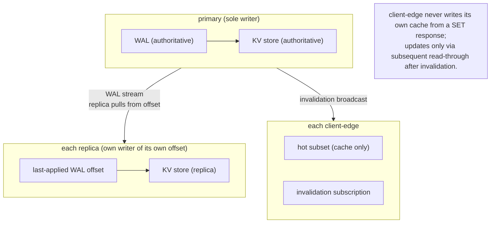
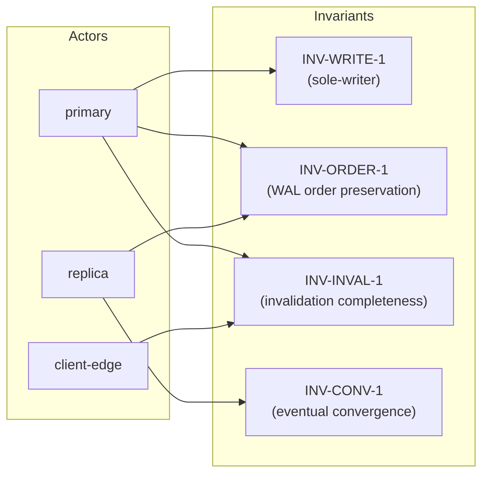

# Worked exemplar: §1.1 / §1.2 / §1.3 in full shape

**Read this top-to-bottom before authoring §1 of a new discovery.** The point is not the domain content — it's the *shape*: how Narrative motivates Claims, how the Diagram adds something prose can't, how each Claim is falsifiable.

The example domain is a generic three-actor distributed-cache system (`primary` / `replica` / `client-edge`). It is deliberately *not* about the project's real domain, so you don't anchor on content; you anchor on shape.

---

## §1.1 Roles

#### Narrative

The system presents itself to applications as a single in-memory cache, but internally it is three role-distinct nodes. The **primary** is the only writer: every `SET` lands on it, and every cache entry's authoritative copy lives there. A **replica** continuously tails the primary's write-ahead log and serves read traffic for entries it has caught up on. A **client-edge** is a process-local read-through cache that holds the hot subset for the application it's embedded in; it never writes back to primary directly, only invalidates.

Concretely, when an application calls `cache.set("k", v)`, the call traverses the embedded client-edge (which records the key for invalidation tracking), reaches primary (which appends to its WAL and commits), then propagates asynchronously to every replica (which applies the WAL entry into its own store). A subsequent `cache.get("k")` from the same or a different application is served either by the local client-edge (if hot), a replica (if the application is configured for replica reads), or primary (for read-your-writes consistency).

The fiction of "one cache" is maintained by primary owning the authoritative state and the replication protocol owning the eventual-consistency guarantee. The client-edge is a *performance* layer, not a *correctness* layer — pulling it out reduces throughput but does not change semantics.

#### Diagram

```mermaid
flowchart LR
    subgraph app["Application process"]
        ce["client-edge<br/>(read-through, invalidate-only)"]
    end
    subgraph cluster["Cache cluster"]
        P["primary<br/>★ sole writer<br/>★ owns WAL<br/>★ authoritative store"]
        R1["replica 1<br/>tails WAL<br/>serves reads"]
        R2["replica 2<br/>tails WAL<br/>serves reads"]
    end
    ce -->|SET, invalidate| P
    P -->|WAL stream| R1
    P -->|WAL stream| R2
    R1 -->|reads (eventually consistent)| ce
    P -.->|reads (read-your-writes)| ce
```

#### Claims

- **Primary.** Sole writer for all keys. Owns the WAL, the authoritative key-value store, and the invalidation broadcast. Lifecycle: long-lived; failover to a promoted replica is a separate (and currently out-of-scope) concern.
- **Replica.** Read-only follower. Continuously consumes primary's WAL stream and applies entries into its local store. Lifecycle: joins by requesting a snapshot + WAL offset; leaves by closing its WAL stream.
- **Client-edge.** Process-local read-through cache embedded in each application. Never authors keys. Owns its own invalidation subscription. Lifecycle: bound to the application process; cold on process start.

---

## §1.2 Ownership model

#### Narrative

Ownership in this system follows a strict single-writer rule for the authoritative copy of each key, and a *strict invalidation-not-update* rule for the client-edge. These two rules together are what make the cache safe to use without a global locking protocol — readers never see torn writes, because writes happen at exactly one place, and stale client-edge entries are evicted on invalidation rather than racefully overwritten.

The single non-obvious split: **the WAL offset on each replica is part of the replica's own state, not primary's.** Primary has no record of how far each replica has caught up; the replication protocol is pull-based, with replicas requesting from their last-applied offset. This is the property that lets a slow or temporarily-disconnected replica reconnect without primary holding per-replica state — but it also means primary cannot directly answer "is replica R consistent with me right now?" without a round-trip.

#### Diagram



#### Claims

- **Primary is the sole owner of every key's authoritative value.** Consequence: any read served by replica or client-edge is by definition no fresher than primary's value at the read's logical timestamp.
- **Primary is the sole owner of the WAL append order.** Consequence: replicas apply entries in primary's commit order; cross-key transactional ordering is preserved across replicas.
- **Each replica is the sole owner of its own last-applied WAL offset.** Consequence: primary cannot independently report "replica R is at offset N" — that fact lives on R. Operational tooling that wants to check replication lag must poll each replica.
- **Each client-edge is the sole owner of its own cache contents.** Consequence: invalidation broadcasts trigger eviction, never overwrite — the next read repopulates via read-through. This avoids race conditions where a stale invalidation arrives after a fresh read.
- **No one owns "cluster-wide consistency state."** Consequence: there is no consistency oracle; clients that need read-your-writes must direct reads at primary, not at any replica.

---

## §1.3 System invariants

#### Narrative

The set below is what makes the "single logical cache" abstraction credible. Each carries an applicability scope — the lifecycle phases (boot / replica-join / steady-state / replica-disconnect / failover) include legitimate transient violations, and the scope is what reconciles "must hold" with "is being established."

Each invariant carries an observable violation symptom — the test or bug-report fingerprint. If you cannot picture what visibly breaks, the invariant is too vague.

#### Diagram



#### Claims

Format: **INV-<scope>-N.** <statement>. **Applicability:** <scope>. **Violation symptom:** …

- **INV-WRITE-1.** Every authoritative write to a key is performed by primary; no replica or client-edge mutates the authoritative store. **Applicability:** `always` — there is no phase in which any other actor is permitted to write authoritatively. **Violation symptom:** two reads of the same key, separated by a network round-trip, return values that diverge in ways primary's WAL cannot explain.

- **INV-ORDER-1.** Each replica applies WAL entries in primary's commit order; no replica observes a commit C2 before C1 if primary committed C1 before C2. **Applicability:** `always` once a replica has begun applying (not during snapshot bootstrap, where the snapshot is a coherent point-in-time). **Violation symptom:** a replica serves a read showing key A's new value but key B's old value, when primary committed both updates in a single transaction with B after A.

- **INV-INVAL-1.** Every commit on primary results in an invalidation message delivered at-least-once to every connected client-edge. **Applicability:** `eventually-consistent during client-edge reconnect` — a client-edge that was disconnected when the commit happened is invalidated lazily (on reconnect, by receiving a "you missed N invalidations, evict everything" signal). `steady-state` otherwise. **Violation symptom:** a client-edge serves a stale value to its application after primary committed an update, with no eviction occurring within the bounded reconnect window.

- **INV-CONV-1.** Given quiescence (no new writes), every replica's store converges to byte-identical contents with primary's store within a bounded time. **Applicability:** `eventually-consistent during steady-state` — the bound is the WAL drain time, not zero. The invariant explicitly *does not* hold instantaneously; it holds as a limit. **Violation symptom:** under sustained quiescence, a replica's store remains permanently divergent from primary's (typically: a missed WAL entry, or a corrupted apply).

---

## What to notice about this exemplar

When you turn to author your own §1, copy the *shape* of each subsection:

- **Narrative.** 2–4 paragraphs. Walks the reader through what this section establishes and *why*. Contains a concrete scenario ("when an application calls `cache.set('k', v)`, the call traverses…"). Names the load-bearing or non-obvious property explicitly. **Zero bullets.**
- **Diagram.** A Mermaid block that adds a shape the prose can't — actor relationships, ownership topology, invariant attribution. If the section doesn't have structural content, the diagram is replaced by `*Skipped — <one-line reason>.*` (visible intentional choice, not silent omission).
- **Claims.** Atomic, falsifiable bullets / numbered items / table rows. Each one is what downstream specs and the §0 matrix cite. Tight; no narrative re-statement here.

Three subsections per leaf, no exceptions.
